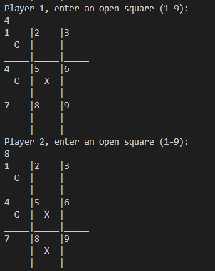

# Overview
 * This is a Tic-Tac-Toe game created for the command line with C++. Currently, it allows two players to play against each other, but I plan to add an AI later on. It alternates players until there is a winner on the board.
# Environment
* VSCode
* MinGW C++ compiler (see link below)
# Execution

# Useful Websites
* [MinGW C++ compiler](http://www.mingw.org/wiki/Install_MinGW)
* [C++ documentation](http://www.cplusplus.com/)